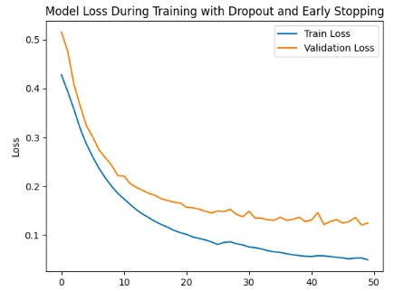

# Anomaly Detection Progress Report

**Objective**: Develop an LSTM Autoencoder to detect anomalies in time-series data using a dataset containing various sensor measurements and `RUL` (Remaining Useful Life).

## Dataset Overview

- **Dataset Size**: 262 entries, 27 columns
- **Features**: 
  - Sensor data (e.g., acceleration, velocity)
  - Rolling statistics (mean, std)
  - Ratios and cumulative values
- **Key Column**: `RUL` (Remaining Useful Life)

## Data Preprocessing

**Steps Taken**:
1. **Imputation**:
   - Filled missing values with column means.
2. **Normalization**:
   - Applied `MinMaxScaler` to scale data to a [0, 1] range.
3. **Synthetic Anomalies**:
   - Created synthetic anomalies for samples with low `RUL` values (bottom 20%).

## Synthetic Anomaly Injection

**Methodology**:
1. Identified low `RUL` samples.
2. Added noise to amplify deviations in selected features.

```python
# Add synthetic noise to low-RUL samples
rul_threshold = data_scaled['RUL'].quantile(0.2)
anomaly_indices = data_scaled[data_scaled['RUL'] < rul_threshold].index
anomaly_data.loc[anomaly_indices] += np.random.normal(0.5, 0.1, anomaly_data.loc[anomaly_indices].shape)
```

## Model Training

### Training Procedure
- **Early Stopping**: Enabled with patience of 10 epochs based on validation loss.
- **Epochs**: Maximum 50
- **Batch Size**: 32

### Training Loss vs. Validation Loss
- Observed loss history to detect overfitting or convergence issues.
- loss: 0.0483 - val_loss: 0.1242
- 

## Testbed Calibration and Testing

### System Preparation

1. **Ball Screw Installation**:
   - Installed SFU2505 ball screw with a max travel length of 2864 mm, supported by appropriate end supports (BK/BF).
2. **Stepper Motor Installation**:
   - Mounted NEMA 23 stepper motor, ensuring alignment and secure coupling with the ball screw.
3. **Motor Driver Installation**:
   - Connected TB6600 driver to the motor with appropriate settings (up to 4 A, 3.3 VDC).
4. **Pulse Generator**:
   - Used a pulse generator or CNC controller to send step pulses to the motor.

### Motion Calculations

1. **Motor Step Calculation**:
   - Motor step angle: 1.8°, requiring 200 steps for a full rotation.
   - Ball screw pitch: 5 mm per rotation, resulting in a 5 mm linear movement per motor rotation.
2. **Microstepping**:
   - Using 16 microstepping subdivisions for smoother motion, where each pulse moves the system by a smaller increment.

### Pulse Variation and Test Parameters

1. **Input Pulse Variation**:
   - Short distances: 10 mm, 50 mm, 100 mm
   - Medium distances: 500 mm, 1000 mm
   - Long distances: 1500 mm, 2000 mm
2. **Microstepping Settings**:
   - Tested at full step, 8, 16, and 32 subdivisions to evaluate the effect on precision and error rate.

## Actual Motion Measurement

1. **Measurement Tool**:
   - Used a caliper to measure actual displacement with a precision of 0.02 mm.
2. **Comparison of Calculated and Actual Distances**:
   - Calculated distance (based on pulses) vs. actual measured distance.
   - Recorded pulse count, calculated distance, actual distance, and error.

## Data Collection and Results

- **Data Collected**:
  - Input pulses
  - Calculated distance (based on motor steps and ball screw pitch)
  - Actual distance (measured)
  - Error rate and magnitude

| No. | Calculated Distance (mm) | Actual Distance (mm) | Error (%) | Error (mm) |
|-----|--------------------------|----------------------|-----------|------------|
| 1   | 10                       | 10.30               | 3.00      | 0.30       |
| 2   | 20                       | 19.79               | 1.05      | 0.21       |
| 3   | 30                       | 29.82               | 0.60      | 0.18       |
| 4   | 40                       | 39.42               | 1.45      | 0.58       |
| 5   | 50                       | 48.69               | 2.62      | 1.31       |
| ... | ...                      | ...                 | ...       | ...        |
| 14  | 140                      | 138.8               | 0.85      | 1.20       |
| **Avg** | -                  | -                   | 1.0387    | 0.5864     |

## Analysis

1. **Average Error**:
   - Percentage: 1.04%
   - Absolute error: 0.59 mm
2. **Error Distribution**:
   - Highest error observed in short-distance tests, where relative error was larger.
   - Lowest error in 110 mm distance, achieving 0% error.

## Error Trend Analysis

1. **Error Trend Based on Distance**:
   - Overall, error tends to decrease as the calculated distance increases, though some fluctuations are present.
2. **Mechanical and Setup Factors**:
   - Higher-than-average errors at certain distances (e.g., 50 mm, 130 mm) may be due to mechanical factors such as backlash or microstepping settings affecting precision.

## Summary of Findings

1. **Testbed Calibration**:
   - Calibration successfully measured the discrepancy between calculated and actual distances.
2. **Error Rate**:
   - Average error rate was within acceptable limits, though smaller distances showed proportionally higher error.
3. **Accuracy**:
   - System demonstrated higher accuracy at longer distances.

## Questions and Discussion

Any questions on the calibration and testing results? Let’s discuss findings, possible improvements, and implications for anomaly detection.

